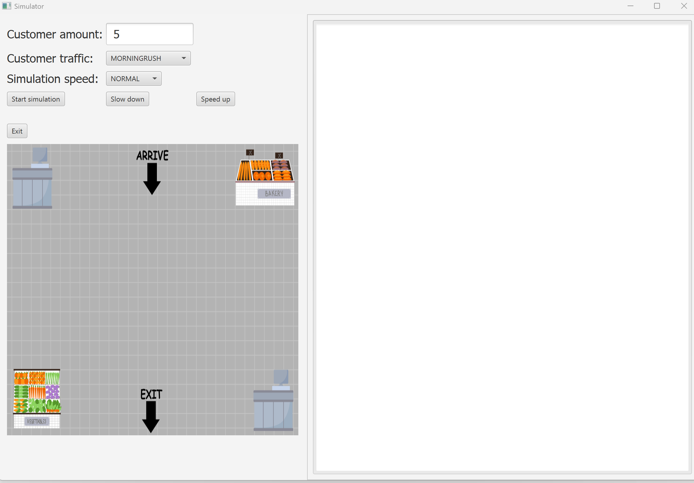

# StoreSimulation - Queuing Time Simulation System

<!-- PROJECT IMAGE -->
<div align="left">
  <a href="https://github.com/gitober/StoreSimulator">
    
  </a>

</div>

## **Introduction**

**StoreSimulation** is an advanced Java-based simulation framework designed to model and analyze queuing systems. Originally developed as a school project and experimental tool, it explores the dynamics of customer service and queuing scenarios in a controlled environment. By leveraging a robust event-driven architecture, the system simulates customer arrival, service, and departure processes, providing insights into queuing times and service efficiency. This simulation tool is ideal for businesses seeking to optimize service points and manage customer flow effectively, as well as for educational and experimental purposes.

---

## **Key Highlights**

### **Simulation Features**
- **Dynamic Queuing Model**:
    - Simulates real-time customer flow, including arrivals, service, and departures.
    - Models customer arrival patterns using configurable distributions (e.g., exponential, uniform).
- **Event-Driven Architecture**:
    - Utilizes a priority queue to manage events in chronological order.
    - Supports flexible event types for arrivals, service initiation, and completions.
- **Customizable Parameters**:
    - Adjustable simulation speed and time duration.
    - Configurable number of service points and maximum customer capacity.
- **Accurate Time Management**:
    - Tracks simulation time using a singleton clock for synchronization.
    - Generates precise timestamps for each event.

### **Backend Features**
- **Event List Management**:
    - Maintains a priority queue for efficient event scheduling and processing.
    - Automatically handles event sequencing based on time.
- **Service Point Management**:
    - Manages availability and utilization of service points.
    - Dynamically assigns customers to free service points.
- **Statistical Logging**:
    - Logs detailed metrics for each event, including arrival, service start, and completion times.
    - Provides real-time and summary statistics for queue performance analysis.

### **Distributions for Arrival and Service Times**
- Leverages **Eduni Distributions** for generating random times:
    - **Exponential Distribution**: Models inter-arrival times with a constant average rate.
    - **Uniform Distribution**: Simulates equally likely intervals within a specified range.
    - **Normal Distribution**: Represents service times with a mean and standard deviation.
    - **Custom Generators**: Allows integration of additional distributions based on requirements.

---

## **How It Works**

### **Simulation Workflow**
1. **Event Initialization**:
    - Creates a series of arrival events using a random time generator.
    - Adds events to the priority queue for chronological execution.
2. **Event Processing**:
    - Processes events sequentially based on their scheduled times.
    - Handles customer arrivals, assigns service points, and records departure times.
3. **Queue Management**:
    - Dynamically adjusts queue size and service point allocation.
    - Tracks waiting times and service durations.

### **Key Components**
- **Clock**:
    - Maintains global simulation time and synchronizes events.
- **EventList**:
    - A priority queue for managing simulation events.
- **ServicePoint**:
    - Represents a single service station with queue management.
- **ArrivalProcess**:
    - Generates customer arrival events based on the specified distribution.

---

## **Technologies Used**

- **Java**: Core programming language for simulation logic.
- **Eduni Distributions**: For generating random arrival and service times.
- **JavaFX**: Interactive GUI for visualizing simulation progress.
- **JDBC**: Database integration for storing and analyzing simulation results.

---

## **Setup and Execution**

### Prerequisites
- **Java Development Kit (JDK) 8 or higher**
- **MariaDB Server** (optional for result storage)
- **IDE** (e.g., IntelliJ IDEA, Eclipse)

### Steps to Run
1. Clone the repository:
   ```bash
   git clone https://github.com/gitober/StoreSimulator.git
   ```
2. Open the project in your preferred IDE.
3. Adjust any database settings in the `MariaDbConnection` class if you intend to use database functionality.
4. Build and execute the `SimulatorGUI` application to start the graphical simulation.

---

## **Future Enhancements**
- Advanced visualization tools for queue dynamics.
- Integration with additional statistical libraries for detailed analysis.
- Enhanced support for multi-server queue simulations.
- Real-time monitoring dashboard for live simulations.

---
